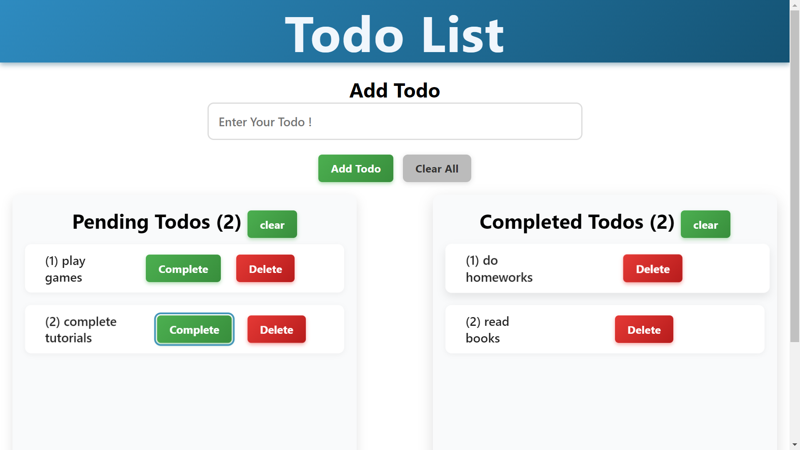

# 📝 To-Do List App

A simple and responsive **To-Do application** built with **React + Vite**, and deployed on **Vercel**.  
This project helps users manage daily tasks by adding, completing, and clearing todos with a clean UI.

🔗 **Live Demo:** [Click Here](https://todo-app-beta-murex.vercel.app/)  
🔗 **GitHub Repo:** [Click Here](https://github.com/alphonsbiju7/Todo-App)

---

## ✨ Features
- ➕ Add new tasks  
- ✅ Mark tasks as completed  
- 🗑️ Delete tasks individually or clear all  
- 📂 Separate sections for **Pending** and **Completed** todos  
- ⚡ Built with **Vite** for faster development  
- 🌐 Deployed on **Vercel**  

---

## 📸 Screenshot
  

---

## 🛠️ Tech Stack
- **React.js** – Frontend framework  
- **Vite** – Fast build tool  
- **CSS** – Styling  
- **Vercel** – Deployment  

---

## 🚀 Getting Started

### 1️⃣ Clone the repository
```bash
git clone https://github.com/alphonsbiju7/Todo-App.git
cd Todo-App
